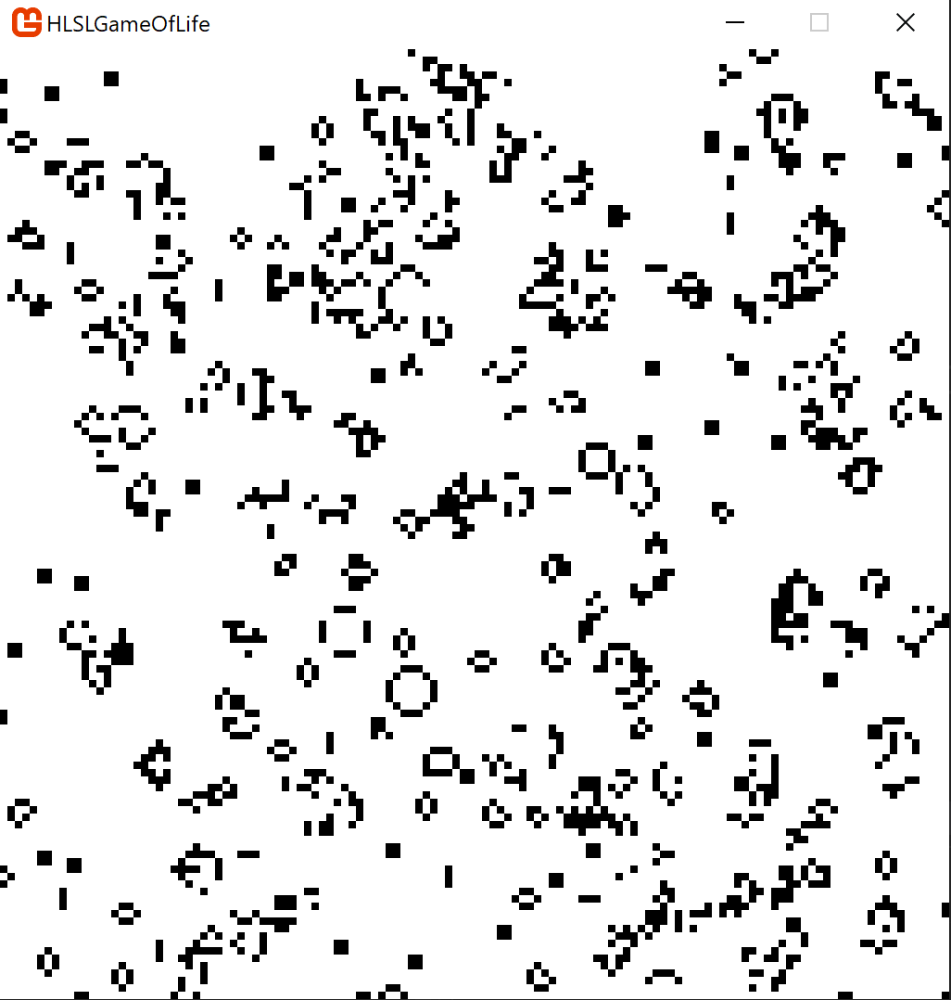

# HLSLGameOfLife

This was a small project I created to begin to learn HLSL with MonoGame.

A build can be found in the Builds folder.

The source code can be found in HLSLGameOfLife.

The HLSL code can be found in GameOfLife.fx.

It's implemented in Game1.cs where it is appled to a RenderTarget2D every frame where the results are displayed and saved for the process to repeat next frame.

